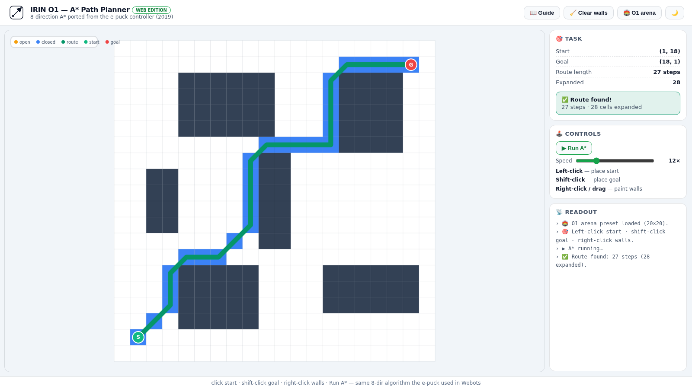

# 🤖 IRIN O1 — A* Path Planning for an e-puck Robot (UPM, 2019)

[](https://www.python.org/)
[](tests/)
[](https://alejp1998.github.io/irin_o1/)

> **▶️ Play it live:** <https://alejp1998.github.io/irin_o1/> — paint walls, set start/goal and watch the e-puck's A* search the grid.

*Trabajo Obligatorio 1 de IRIN* (Inteligencia Robótica, UPM, 2019, Grupo 22):
an e-puck robot in the Webots simulator navigates a 20×20 grid arena using a
**subsumption architecture** (wandering, obstacle avoidance, goal-seeking,
recharging) with an **A\* path planner** on top. The controller
(`iri1controller.cpp`) builds a map of explored cells from its ground-memory
sensor and plans routes with the classic 8-direction A\*.

## 🧮 The A* algorithm (ported)

`astar.py` is a **1:1 port** of the controller's `pathFind()`:

- **8 directions** with a straight-line bias — straight moves cost 0, diagonals cost 2
- priority = `level + estimate×10` (Chebyshev-like heuristic)
- route encoded as a string of direction indices, exactly like the C++

```bash
pip install -e ".[dev]"
pytest -q      # 8 tests: optimality, obstacle avoidance, unreachable goals, bias
```

The JavaScript port (`webgame/js/astar.js`) has a matching 7-test suite and
drives the interactive page.

### 🖼️ Screenshots


## 🎮 Interactive web edition

`webgame/` — an A* visualizer on the same 20×20 grid the robot planned on:

- **left-click** — place the start · **shift-click** — place the goal · **right-click/drag** — paint walls
- **▶ Run A\*** — animated search: amber = open set, blue = closed set, green = the route
- **🏟️ O1 arena** — a preset inspired by the Webots map
- speed slider, expanded-cell and route-length readouts, guide modal

## 📁 Layout

```
iri1controller.cpp/.h   Webots controller (subsumption + A*)
iri1exp.cpp             experiment setup
O1Map1.txt / O1Map2.txt Webots scenario configs
astar.py + tests/       extracted, unit-tested A* port
webgame/                interactive visualizer + JS port
Grupo22_O1.pdf          the report
```
